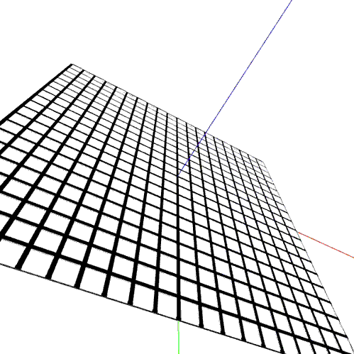

# Pixcity3D
Procedural 3D City made with Processing & PeasyCam. Inspired by Shamus Young amazing work "PixelCity" https://www.youtube.com/watch?v=-d2-PtK4F6Y

## Gifs

### 0.0.1

- Added peasycam lib

### 0.0.1 Auto

- Added auto rotate

### 0.0.2 Vectors

- Added square corners and vector for position

### 0.0.3 Vectors

- Added buildings in corners

### 0.0.4 Vectors

- Checking buildings heights 

### 0.0.5 Vectors

- Retrowave and old school style =) 

